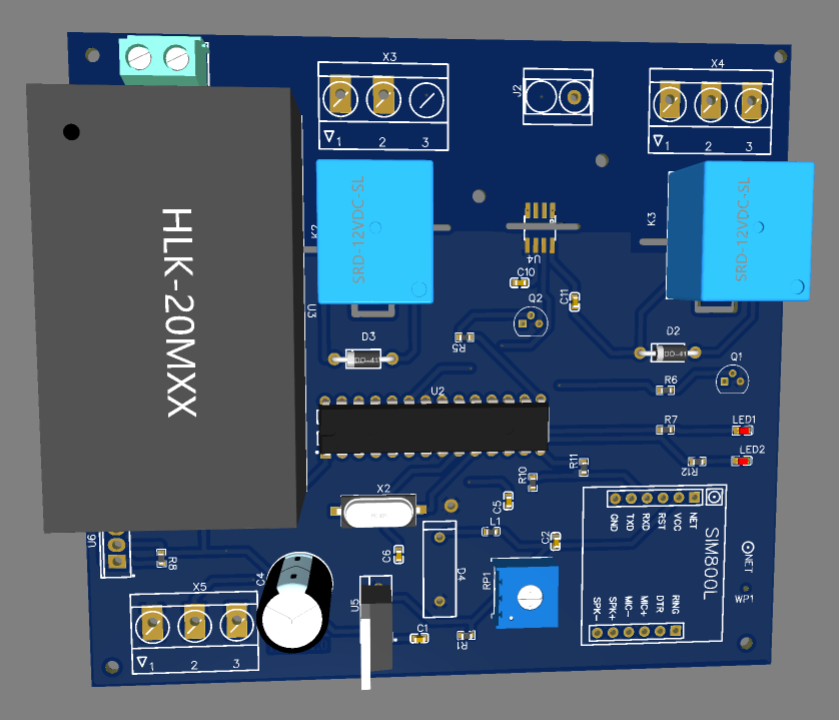
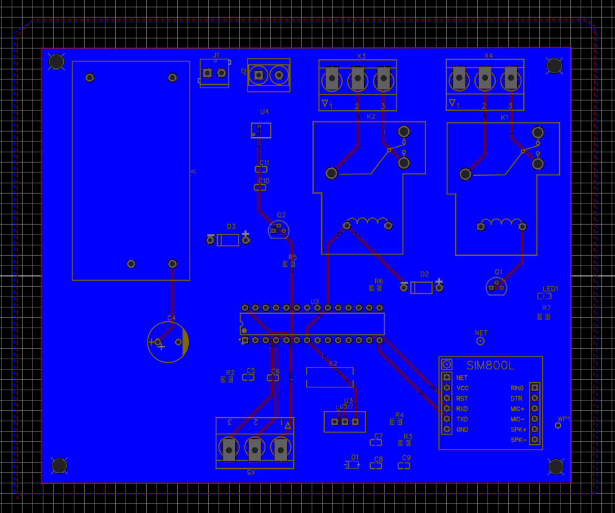
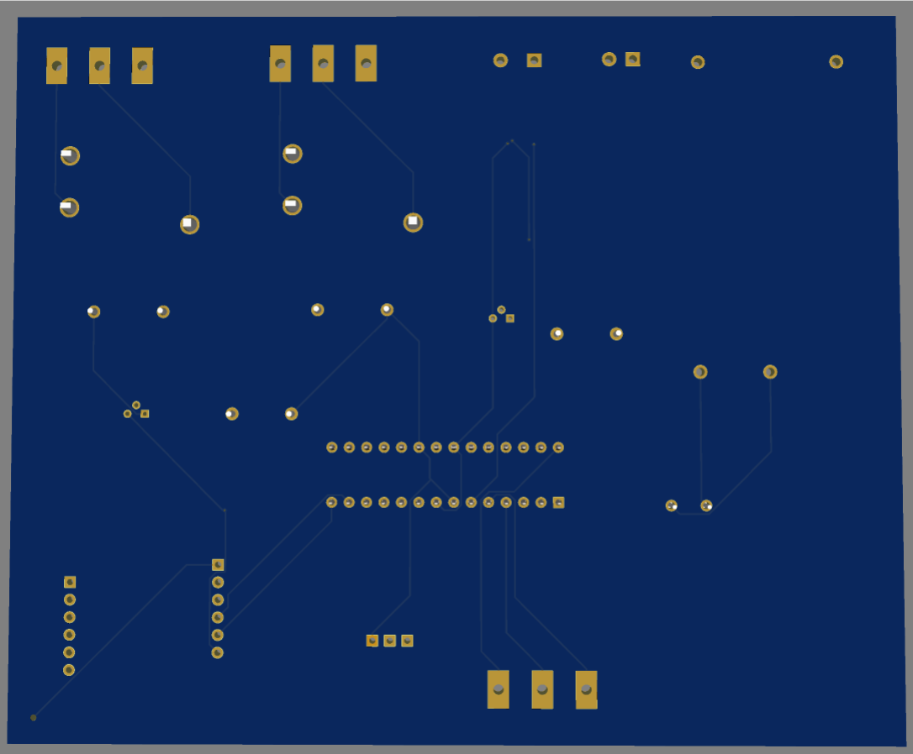
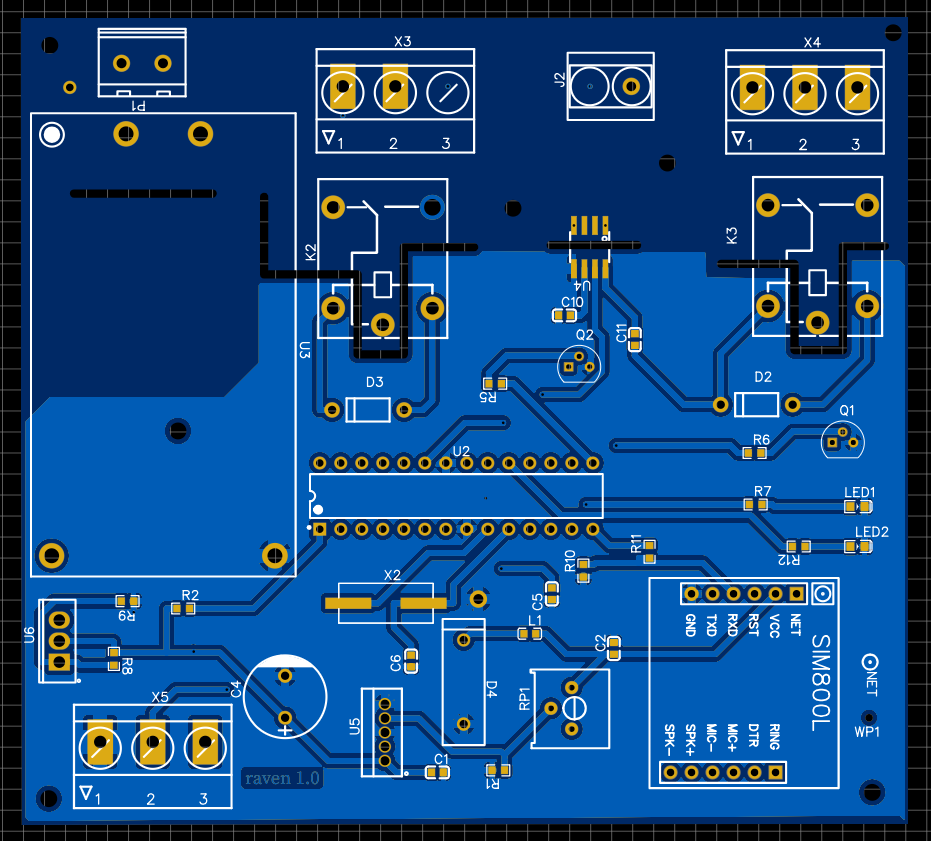

# simpleIoT_gsmsim800l 
-simplest atmega328p pcb 240V input, gsm sim800l enabled for IoT, collects and sends data via post connection to a remote MySQL database, receives commands to actuate a set of relays, LEDs etc  

## Key features include: 
-Based on Arduino atmega328p 
-Current sensor 
-Relays 
-Led 
-GSM Sim800l 
-240V mains input 
-Buck converter to stepdown voltage for sim800l from 5V logic, ensure 2A supply for transmission bursts of the SIM800L  

Code features:  
-Post connection to MySQL database 
-MQTT protocol implementation. 
-Timer for synchronization between measurements, post transmission and actuation of peripgeral components. 

# Screen shots: 
  
  
  
  
  
  
  

## Updates coming soon  

